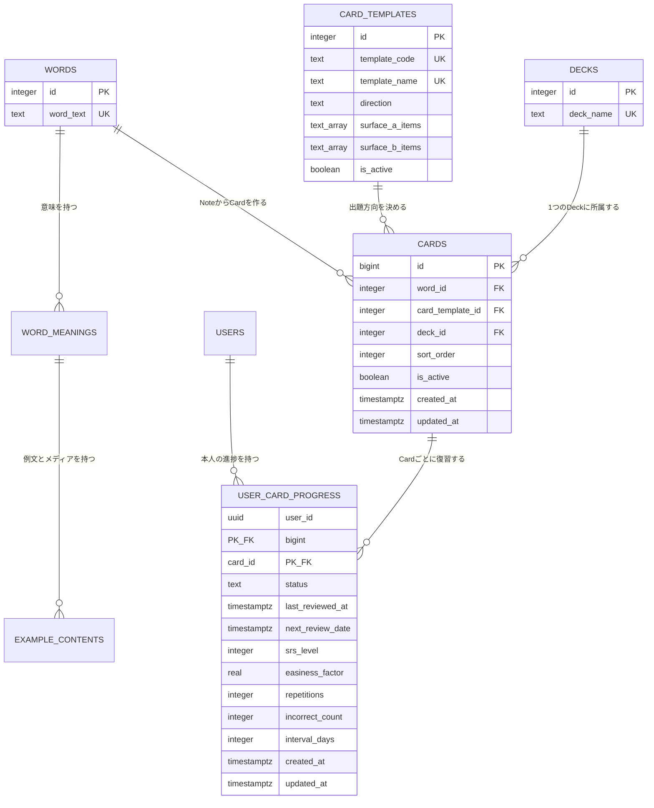

# Anki型データモデルと移行設計

最終更新日: 2026-08-10  
対象: SwiftUIアプリ `apps/ios-swiftui/` とSupabase  
状態: 設計・migration・SwiftUIのCard ID対応・ローカル自動テストまで完了。本番DBには未適用

## 1. 一言でいうと

今は「単語」が学習カードの役目まで兼ねています。これを次の5つへ分けます。

1. `words` など: 運営が用意する元情報（Note）
2. `card_templates`: 問題の出し方（Card Type）
3. `cards`: 利用者が実際に学ぶ1枚（Card）
4. `decks`: Cardを入れる箱（Deck）
5. `user_card_progress`: 利用者ごとのCardの復習予定

既存テーブルは先に消しません。新しい表へコピーして結果を確認し、SwiftUIを切り替えた後もしばらく旧表を残します。

## 2. この設計で確定すること

- Noteの根は既存の `words.id` とする。
- `word_meanings` と `example_contents` はNoteに属する公式コンテンツとして残す。
- 既存の `card_templates` をCard Typeとして育て直す。別のテンプレート表は作らない。
- `cards` を新設し、学習・出題・復習の単位を `cards.id` にする。
- 1つのCardは1つのDeckだけに所属する。
- Cardの一意条件は `word_id + card_template_id + deck_id` とする。
- 進捗の一意条件は `user_id + card_id` とする。
- 最初のCard Typeは「英語から日本語」だけを有効にする。
- 端末TTS、複数アルゴリズム、ユーザー独自デッキは含めない。

Ankiと同じく、元情報、問題の出し方、学ぶ1枚、所属する箱、復習記録を別々の責任にします。一方で、Ankiのファイル形式やテンプレート言語の完全互換は目指しません。

## 3. ER図

## 4. 各テーブルの責任

### 4.1 `words`、`word_meanings`、`example_contents`

既存データをそのまま公式Note情報として使います。

- `words.id` がNoteの安定した識別子になる。
- `word_meanings` は意味を `priority`、続いて `id` の順で扱う。
- `example_contents` は対象テーマ、続いて `id` の順で扱う。
- 最初のCard Typeは、最優先の意味と運営が選んだ例文・画像・音声参照を表示する。
- コンテンツ自体の制作や監査は別ルートで行い、この移行では内容を書き換えない。

現在は1,000語すべてに意味と例文が1件ずつあります。将来複数件になっても同じCard IDを保てるよう、Cardは意味や例文ではなくNoteの根である `word_id` を参照します。

### 4.2 `card_templates`

既存表を残し、次の列を追加する設計とします。

| 列 | 役割 |
|---|---|
| `template_code` | アプリが使う変更しない識別子。例: `basic_en_to_ja` |
| `direction` | 出題方向。最初は `en_to_ja` |
| `is_active` | 新しいCardを作り、アプリに出すか |

既存の `template_name`、`surface_a_items`、`surface_b_items` は再利用します。表示項目は運営が管理する許可済みの項目名だけに限定し、任意コードを実行するテンプレートDSLにはしません。

最初に登録する行は1件です。

| 値 | 内容 |
|---|---|
| `template_code` | `basic_en_to_ja` |
| `template_name` | 英語 → 日本語 |
| `direction` | `en_to_ja` |
| 表 | 英単語、必要な場合はイラスト |
| 裏 | 日本語の意味、例文、運営音声の参照 |
| `is_active` | `true` |

### 4.3 `cards`

新設する学習単位です。

| 列 | 制約・役割 |
|---|---|
| `id` | bigintの自動採番PK。Swiftの `Int` で扱える |
| `word_id` | `words.id` への必須FK |
| `card_template_id` | `card_templates.id` への必須FK |
| `deck_id` | `decks.id` への必須FK |
| `sort_order` | Deck内の安定した表示・学習順 |
| `is_active` | 削除せずに出題対象から外すための印 |
| `created_at` / `updated_at` | 作成・更新日時 |

一意制約は `(word_id, card_template_id, deck_id)` です。同じ単語が複数Deckへ必要な場合は、Deckごとに別Cardを作り、進捗も別に持ちます。

参照先の `words`、`card_templates`、`decks` は、Cardがある間は物理削除しません。通常は `is_active` で停止し、学習進捗の意図しない連鎖削除を防ぎます。

外部キーの削除規則は `word_id`、`card_template_id`、`deck_id` のすべてを `RESTRICT` とします。

必要な索引は次です。

- `(deck_id, is_active, sort_order, id)`: DeckのCard一覧
- `(word_id, card_template_id)`: 同じNoteからできたCardの確認
- `card_template_id`: Card Typeごとの確認

### 4.4 `user_card_progress`

既存 `user_learning_progress` と同じ復習状態を、Card単位で持つ新設表です。

| 列 | 制約・役割 |
|---|---|
| `user_id` | `users.id` への必須FK |
| `card_id` | `cards.id` への必須FK |
| `status` | `learning` / `review` / `mastered` |
| `last_reviewed_at` | 最終回答日時。未回答ならNULL |
| `next_review_date` | 次回復習日時 |
| `srs_level` | 現在の学習レベル |
| `easiness_factor` | 現行SM-2ハイブリッドの係数 |
| `repetitions` | 連続正解回数 |
| `incorrect_count` | 累積不正解数 |
| `interval_days` | 現在の復習間隔 |
| `created_at` / `updated_at` | 作成・更新日時 |

主キーは `(user_id, card_id)` です。「未学習」は行が存在しない状態で表し、新しい行は最初の回答時に作ります。既存データにある `review` 状態も失わず引き継ぎます。

`srs_level` は1〜5、`easiness_factor` は1.3以上、各回数と日数は0以上というCHECK制約を付けます。新しい復習計算は2.5を上限にしますが、既存進捗にある2.5超の値はデータ保全のため変更せず移します。`user_id` は利用者削除時に `CASCADE`、`card_id` は進捗の事故消失を避けるため `RESTRICT` とします。

必要な索引は次です。

- `(user_id, next_review_date, card_id)`: 期限が来たCard
- `(user_id, status)`: 学習状態別の集計
- `(user_id, incorrect_count desc, card_id) where incorrect_count >= 3`: 苦手Cardだけを対象にした部分索引
- `card_id`: Card外部キーの確認

今回の完成境界では、回答1回ごとの履歴表は追加しません。`user_card_progress` は最新状態の正本です。回答履歴が必要になる高度な統計は、別課題で `card_review_events` を検討します。

## 5. 現在から移行後への対応表

| 現在 | 移行後 | 扱い |
|---|---|---|
| `words` | `words` | Noteの根として継続 |
| `word_meanings` | `word_meanings` | Noteの意味情報として継続 |
| `example_contents` | `example_contents` | Noteの例文・メディア参照として継続 |
| `card_templates` | `card_templates` | 列を追加しCard Typeとして利用 |
| `deck_words` | `cards.word_id + cards.deck_id` | Backfill元。切替後は読み取り停止 |
| なし | `cards` | 新設。学習単位 |
| `user_learning_progress.word_id` | `user_card_progress.card_id` | 全列をCard単位へコピー |
| `user_word_tags.word_id` | 変更なし | Note単位の補助情報として残す |
| `user_word_overrides.word_id` | 変更なし | 今回は移行しない。コア採用可否は別判断 |

## 6. 2026-08-10時点の読み取り監査

本番Supabaseへ変更を加えず、件数、外部キー、重複、RLSだけを確認しました。

| 確認項目 | 結果 |
|---|---:|
| `words` | 1,000件 |
| `word_meanings` | 1,000件 |
| `example_contents` | 1,000件 |
| `decks` | 1件 |
| `deck_words` | 1,000件 |
| `card_templates` | 0件 |
| `user_learning_progress` | 88件 |
| 孤児の `deck_words` | 0件 |
| 孤児の進捗 | 0件 |
| 重複したDeck所属 | 0件 |
| 進捗があるのにDeck所属がない単語 | 0件 |
| 複数Deckに所属する単語 | 0件 |

現在の88件は `learning` 50件、`review` 38件で、移行対象列にNULLはありません。そのため、現時点の期待値は「1,000 Card、88進捗」です。ただし、本番適用直前に再集計し、その時点の値を正とします。

`easiness_factor` は58件が2.5を超え、最大2.65でした。値を丸めると既存の復習予定を変えるため、移行では元の値を保持します。新しく作る進捗は2.5から始め、次のSwift切替で回答更新後の値を2.5以下へ収めます。

見つかった設計上の不足は次です。

- `user_learning_progress.word_id` に `words.id` への外部キーがない。
- 復習期限取得用の `(user_id, next_review_date)` 索引がない。
- 現行表は広いGRANTをRLSで止める構成になっている。
- 新設表は今後のSupabase Data API既定変更に備え、必要な権限だけを明示的にGRANTする必要がある。

## 7. RLSとData API権限

RLSだけでなく、GRANTも別の安全扉として設計します。

### 公式コンテンツ

対象: `card_templates`、`cards`

- `anon`: 権限なし
- `authenticated`: `SELECT` だけ
- `service_role`: 運営処理に必要な権限
- RLS: 認証済み利用者の `SELECT` のみ許可
- 利用者の `INSERT`、`UPDATE`、`DELETE` は許可しない

現在のSwiftUIはログイン後に学習するため、匿名公開は不要です。既存コンテンツ表の匿名公開方針は、この移行で一緒に変えず、別のセキュリティ課題で見直します。

### 個人の進捗

対象: `user_card_progress`

- `anon`: 権限なし
- `authenticated`: `SELECT`、`INSERT`、`UPDATE`。アプリで削除を使うまで `DELETE` は付けない
- `service_role`: 移行・運営に必要な権限
- RLSの各ポリシーは `TO authenticated` を明記する
- SELECT/DELETEの `USING`: `(select auth.uid()) = user_id`
- INSERTの `WITH CHECK`: `(select auth.uid()) = user_id`
- UPDATEは同じ条件を `USING` と `WITH CHECK` の両方へ設定する

RLSで使う `user_id` は複合主キーの先頭なので、所有者確認用の索引としても利用できます。

## 8. 移行手順

### Phase 0: 適用前監査

1. 件数、孤児、重複、NULL、状態値を再集計する。
2. `deck_words` の全行に有効な `words` と `decks` があることを確認する。
3. 全進捗に対応する `deck_words` があることを確認する。
4. DBバックアップまたは復旧可能な時点を確認する。
5. 期待件数を移行ログへ記録する。

1件でも不一致があれば、書き込みを始めず停止します。自動で「未分類Deck」を作って隠しません。

### Phase 1: 新構造を足す

1. `card_templates` に安定コード、方向、有効状態を追加する。
2. `basic_en_to_ja` を1件登録する。
3. `cards` を作成する。
4. `user_card_progress` を作成する。
5. 必要な制約、索引、RLS、明示GRANTを作成する。

この段階ではSwiftUIは旧表を使い続けます。

### Phase 2: Cardを作る

`deck_words` の各行と有効なCard Typeを組み合わせ、`cards` へ入れます。

- 現在の期待値: 1,000件
- `sort_order`: Deck内で既存 `word_id` の昇順を初期値にする
- 同じ移行を再実行しても増えないよう、一意制約を使う
- 作成後に `deck_words` と `cards` の対応漏れを0件まで確認する

### Phase 3: 進捗をコピーする

`user_learning_progress` を `word_id` で `cards` と結び、同じ復習状態を `user_card_progress` へコピーします。

- 現在は1単語が1Deckだけなので、88件は88件になる。
- 適用時に同じ単語が複数Deckへ所属していた場合は、各Cardへ同じ初期状態をコピーする。
- コピー後はCardごとに独立して復習状態を更新する。
- 対応先Cardが0件の進捗があれば切替を停止する。

### Phase 4: 検証してSwiftUIを切り替える

1. Card件数、進捗件数、各列の一致、孤児0件を確認する。
2. RLSを利用者A、利用者B、匿名の3通りで確認する。
3. Data APIから `cards` の読取と `user_card_progress` の本人行upsertを確認する。
4. Swiftのモデルと `StudyService` を `card_id` 基準へ切り替える。
5. 自動テストと手動の学習1周を通す。

アプリ切替直前に最終差分コピーを行います。本アプリは未公開のため、切替中はテスト回答を止め、複雑な二重書き込みは導入しません。

2026-08-15時点で、SwiftUIのモデルと `StudyService` は `card_id` 基準へ切り替え済みです。Card IDを使う学習キュー、回答保存、再読み込みと、復習計算・メディア欠損処理を含む13件のローカルXCTestが成功しています。ただし、これはモックを含むSimulatorテストであり、本番Supabaseの新テーブル、RLS、Data APIを通した確認ではありません。

### Phase 5: 旧構造を止める

1. SwiftUIから `deck_words` と `user_learning_progress` の利用が0件であることを確認する。
2. 旧表へのクライアント書き込み権限を止める。
3. 旧表は削除せず、照合用に残す。
4. 安定確認後の削除は別マイグレーション、別承認にする。

## 9. 切り戻し

### SwiftUI切替前

新表は利用されていないため、旧構造のまま動作を継続できます。新表を急いで削除する必要はありません。

### SwiftUI切替後

1. 新規回答を止める。
2. `user_card_progress` の差分を退避する。
3. SwiftUIを旧 `word_id` 版へ戻す。
4. 旧 `user_learning_progress` の権限を戻す。
5. 差分の扱いを人間が確認する。

CardはDeckごとに独立するため、複数Cardの進捗を1つの `word_id` へ自動で戻すと情報が失われます。したがって、切替後の完全自動な逆コピーは行いません。未公開開発中の移行では、切戻し時に新構造で発生したテスト回答を破棄するか、最新値を採用するかを人間が決めます。

## 10. 完了判定とテスト対象

### DB

- `card_templates` に有効な `basic_en_to_ja` が1件ある。
- `deck_words` の各行に対応する有効Cardが1件ある。
- `cards` に孤児FKと一意条件違反がない。
- 旧進捗の全行に1件以上の移行先がある。
- コピーした進捗の全列が旧表と一致する。
- 期限順クエリが `(user_id, next_review_date, card_id)` 索引を利用できる。

### RLS・API

- 利用者AはAの進捗だけを読取・追加・更新できる。
- 利用者AはBの進捗を読取・追加・更新できない。
- 匿名利用者は新しい3表を利用できない。
- 認証利用者は公式Cardを読めるが変更できない。
- REST APIから必要な操作ができ、不要な操作は拒否される。

### SwiftUI

- `WordCard` と `LearningProgress` が `card_id` を保持する。
- Deckを選ぶと、そのDeckの有効Cardだけを取得する。
- 期限Card、新規Card、苦手Cardの順序と上限が維持される。
- 回答は `(user_id, card_id)` でupsertされる。
- 同じNoteの別Cardで進捗が混ざらない。
- 既存の画像・運営音声参照が維持される。

## 11. 今回やっていないこと

- 本番DBへのDDL・データ移行
- migrationを安全なローカルDBまたは開発用DBへ適用した実行検証
- 本番Supabaseの新テーブル、RLS、GRANT、Data APIを使う学習1周
- 本格UIUX
- 回答イベント履歴と高度な統計
- 通知、オフライン、課金、App Store対応
- TTS（採用しない。運営が用意した音声だけを再生する）
- 旧 `user_settings.tts_config` や個人編集機能の整理
- 旧表の削除

## 12. 次に始める課題

`DB｜Anki migrationを安全なDBへ適用して検証する`

作成済みの `supabase/migrations/20260810065120_create_anki_cards_and_migrate_progress.sql` をローカルまたは開発用環境へ適用し、Card件数、進捗コピー、RLS、Data API、切り戻し条件を検証します。その合格後に本番を再監査し、本番適用は人間の承認後に行います。

## 13. 参照した公式資料

- [Anki Manual: Getting Started](https://docs.ankiweb.net/getting-started.html)
- [Supabase: Row Level Security](https://supabase.com/docs/guides/database/postgres/row-level-security)
- [Supabase: 新しい表のData API自動公開に関する変更](https://supabase.com/changelog/45329-breaking-change-tables-not-exposed-to-data-and-graphql-api-automatically)
